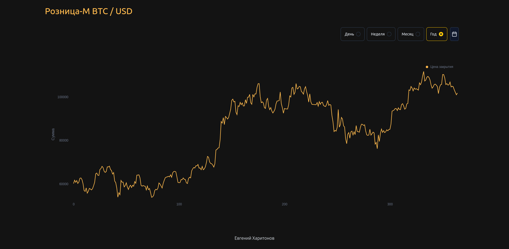

# Retail-M

## Retail-M — веб-приложение для анализа динамики стоимости криптовалюты Bitcoin. Проект состоит из двух основных частей: серверная сторона (server) и клиентская сторона (client).

  

## 🛠️ Запуск проекта:

### Перед запуском убедитесь, что установлены Docker и Node.js.

#### Серверная часть (server):

cd server # Переход в директорию серверной части

mv .env-example .env # Создаем конфигурационный файл `.env`

docker compose up -d # Поднимаем контейнеры Docker

#### Затем выполняем миграцию базы данных и загрузку начальных данных:

npm run db-generate # Генерация структуры БД

npm run db-migrate # Выполнение миграции

npm run db-seed # Загрузка данных c API https://min-api.cryptocompare.com/data/v2

npm run start:dev # Запуск приложения в режиме разработки

#### Клиентская часть (client):

##### Переходим в клиентскую часть приложения:

cd ../client # Переход в директории клиента

mv .env-example .env # Создаем конфиг-файл `.env`

npm install # Установка зависимостей

npm run dev # Запуск разработки в режиме разработчика

Открываем браузер и переходим по адресу http://localhost:3000, чтобы увидеть приложение в действии.

### 📊 Основные возможности:

Отображение истории изменения цены биткоина.

Возможность фильтрации данных по временному диапазону.

Удобное взаимодействие с API для загрузки новых данных.

Обновление данных каждый час с API.

#### Проект готов к запуску и дальнейшей разработке!
